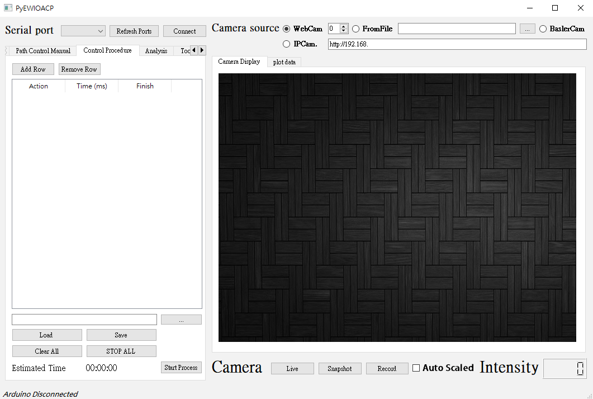
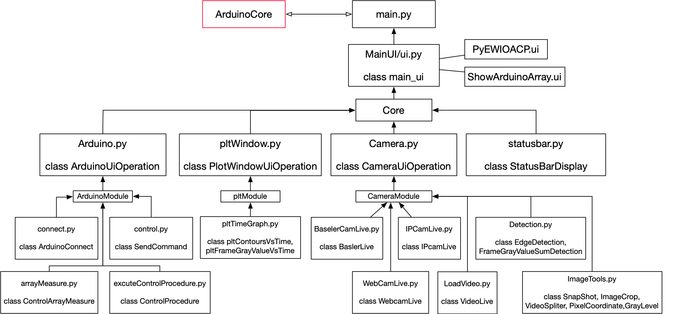

# PyEWIOACP
ElectroWetting Image Operate with Arduino Control Platform(PyEWIOACP) is [TaroballzChen's](https://github.com/TaroballzChen/PyEWIOACP) research tools developed by python programing during the Ph.D.



# Requirement
```text
PyQt5
pyserial
opencv-python
matplotlib
pandas
pypylon
pyvisa
```
if prefer using industrial camera of Basler as video source, please follow the steps below

1. Download the [**_pylon_**](https://www.baslerweb.com/en/sales-support/downloads/software-downloads/) camera software suite from basler official website
2. Install [**_pypylon_**](https://github.com/basler/pypylon) which the python wrapper for the Basler pylon Camera Software Suite

# Installation
```cmd
git clone git@github.com:JzzzHung/PyEWIOACP.git
conda create --name PyEWIOACP python=3.7
conda activate PyEWIOACP
cd PyEWIOACP/
mkdir snapshot_pic
pip install -r requirements.txt
```
* If you don't have git, you can ignore the first line of command and manually download this repository.
* If you don't have Anaconda or Miniconda, you can ignore the second and the third line of command.

# Architecture


# Usage
```cmd
cd PyEWIOACP

mkdir snapshot_pic

python main.py
```

# Reference

* <https://github.com/curtis992250/Arduino-Control-Interface-for-Electro-Wetting>

# Update

* 2024.05.17 Add Agilent 33500 Series 2-channel waveform generator remote control
* 2019.09.05 Add module which plotting contours area against frame 
* 2019.09.10 Add image gray level transform function
* 2019.12.17 Add IPcamera module 
* 2020.01.09 Add automated process setup module
* 2020.01.19 Add pltdata output function & estimate frame gray value function
* 2020.01.21 Add Estimate time that procedure consuming function 
